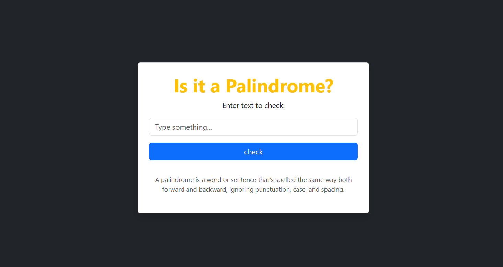

# Palindrome Checker

This project is a simple **Palindrome Checker** built using **HTML**, **Bootstrap 5**, and **JavaScript**.  
It allows users to input a word or phrase and check whether it is a palindrome — a word that reads the same backward as forward, ignoring case, spaces, and punctuation.

---

## 🖼️ Screenshot



---

## ✨ Features

- Responsive design using Bootstrap 5
- Clean and user-friendly interface
- Validates user input and handles empty fields
- Displays dynamic result messages with Bootstrap alert styles
- Ignores punctuation, spaces, and case sensitivity when checking for palindromes

---

## 🛠️ Technologies Used

- HTML5
- Bootstrap 5
- JavaScript (DOM manipulation & event handling)

---

## 🚀 How to Use

1. Clone or download this repository:
   ```bash
   git clone https://github.com/marna4255/JS-Bootstrap-palindrome-checker.git
   Open index.html in any modern web browser.
   ```

Enter a word or sentence into the input box.

Click the Check button to see if it’s a palindrome.

Result will be shown dynamically below the input.

📜 License
This project is licensed under the MIT License — see the LICENSE file for details.

🤝 Contributing
Contributions are welcome!
Feel free to fork this repository, make improvements, and submit a pull request.
